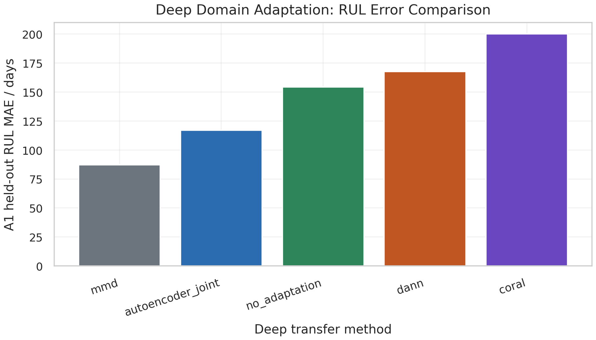
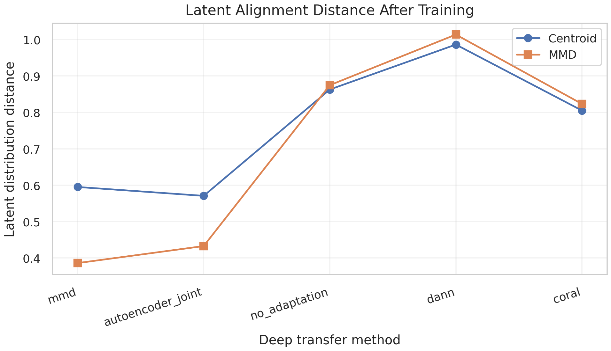
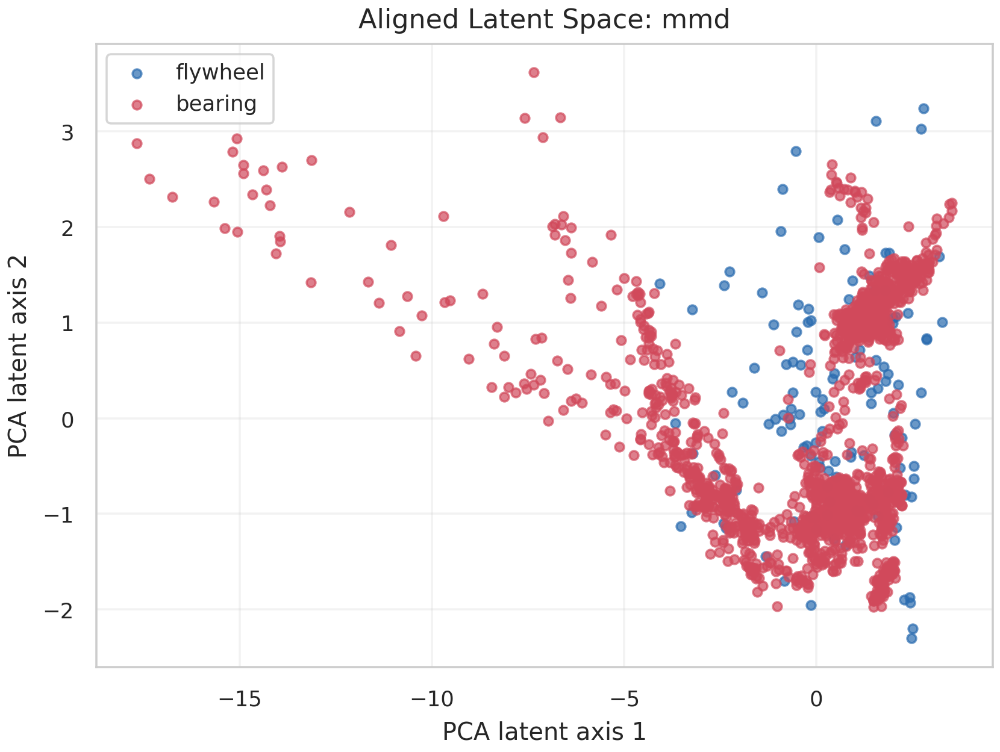

# 深度域适配增强实验报告

## 1. 实验定位

本实验补充真正的 PyTorch 深度迁移训练流程，包括 Bearing Encoder、Flywheel Encoder、共享 latent、RUL/退化进度预测头，以及 DANN、CORAL、MMD、AutoEncoder-joint 四类域适配训练策略。
原有任务三推荐结论仍采用可解释的退化严重度迁移校准；本实验作为深度迁移可行性验证和论文增强证据。

## 2. 训练与验证设置

- 飞轮输入特征：`['current_norm', 'temperature_norm', 'speed_rpm_norm', 'HI_common_raw', 'HI_common_smooth', 'HI_common_derivative']`
- 轴承输入特征数量：`30`
- latent 维度：`8`
- 训练轮数：`260`
- 验证方式：使用附件 1 已知全寿命终点，将前 70% 作为飞轮训练段，后 30% 作为真实 RUL 误差测试段。

## 3. 迁移前后 RUL 误差对比

| 方法 | A1测试 MAE/天 | A1测试 RMSE/天 | A2参考 RUL/天 | latent MMD | latent CORAL |
|---|---:|---:|---:|---:|---:|
| mmd | 87.2 | 101.6 | 408.5 | 0.3861 | 0.000255 |
| autoencoder_joint | 117.1 | 141.7 | 377.4 | 0.4329 | 0.001059 |
| no_adaptation | 154.2 | 174.0 | 119.0 | 0.8747 | 0.020260 |
| dann | 167.7 | 199.0 | 6200.0 | 1.0138 | 0.029077 |
| coral | 200.0 | 213.4 | 4.9 | 0.8233 | 0.004450 |

最佳深度迁移方法为 `mmd`，其附件 1 后 30% 真实 RUL 测试 MAE 为 `87.2` 天。
该方法对附件 2 当前时刻给出的深度模型参考 RUL 为 `408.5` 天。

## 4. 结论

与 no_adaptation 相比，若 CORAL/MMD/DANN/AutoEncoder-joint 的测试误差和 latent 分布距离下降，则说明轴承退化表征对飞轮 RUL 建模具有可迁移价值。若个别深度方法误差不降，论文中应如实说明深度迁移受样本量、时间尺度差异和模态差异限制。

## 5. 输出文件

- `results/deep_transfer/deep_transfer_summary.json`
- `results/deep_transfer/deep_transfer_method_comparison.csv`
- `results/deep_transfer/deep_transfer_rul_point_predictions.csv`
- `results/deep_transfer/deep_transfer_latent_features.csv`
- `figures/deep_transfer/deep_transfer_rul_error_comparison.png`
- `figures/deep_transfer/deep_transfer_latent_distance.png`
- `figures/deep_transfer/deep_transfer_best_latent_pca.png`

## 6. 图像

