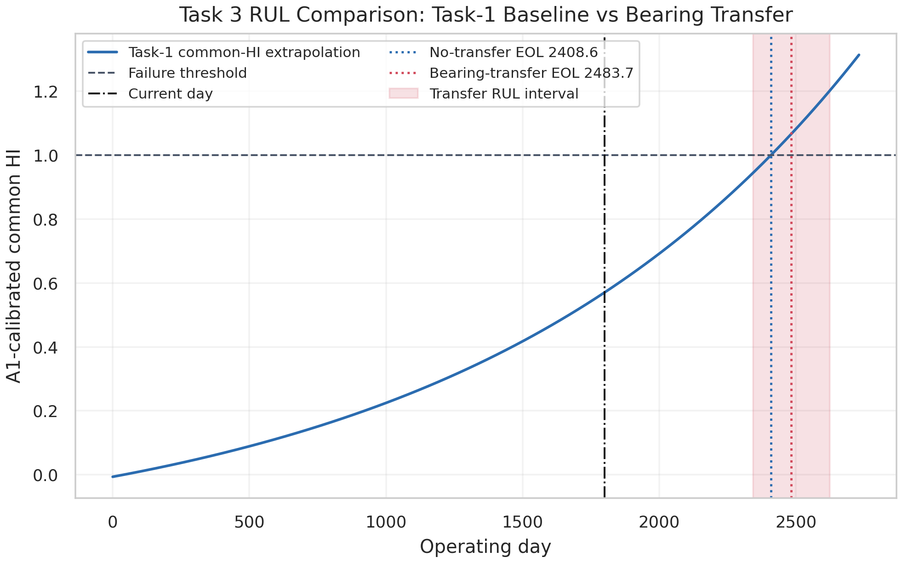
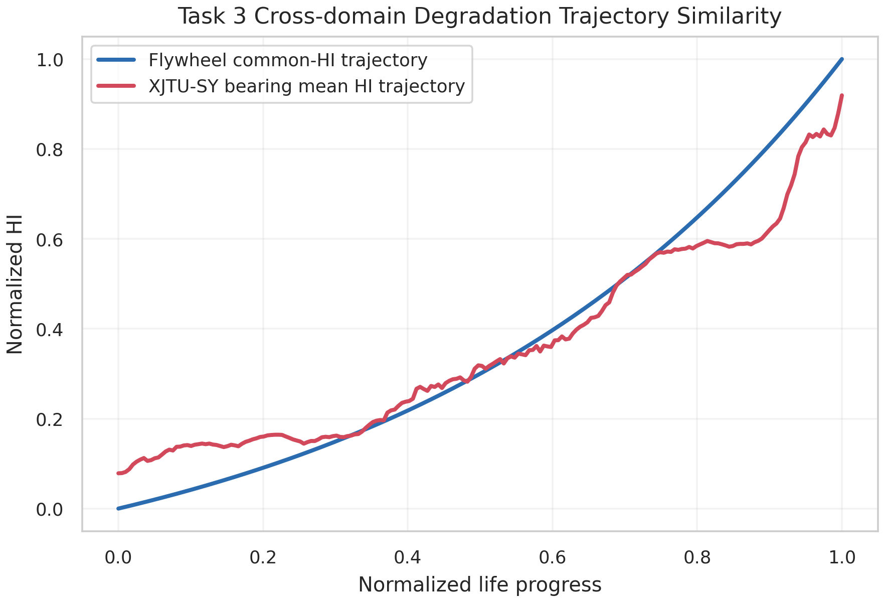
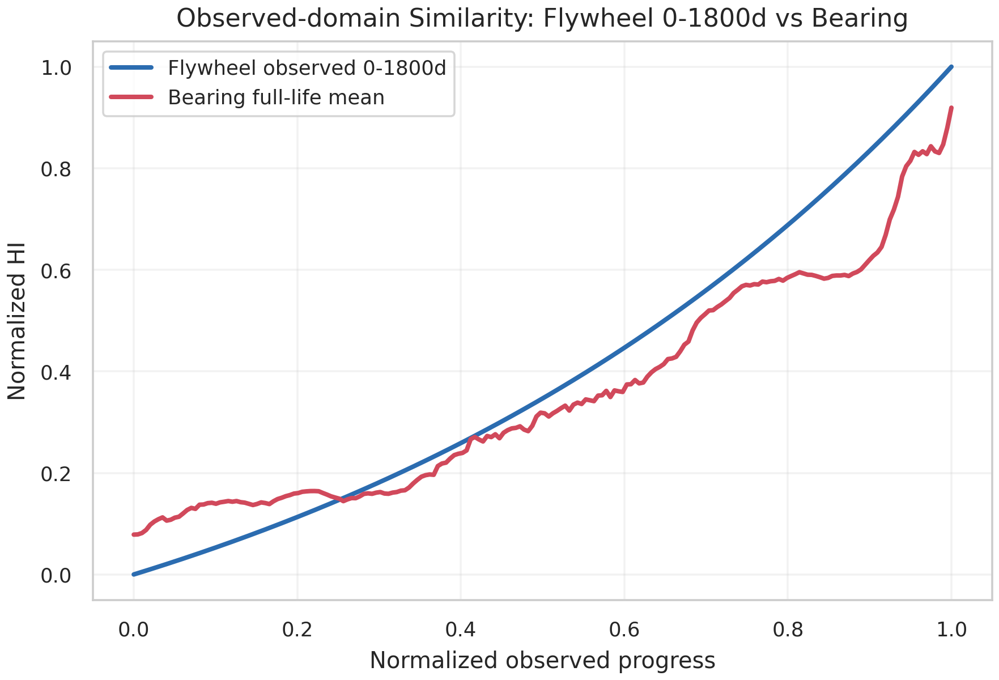
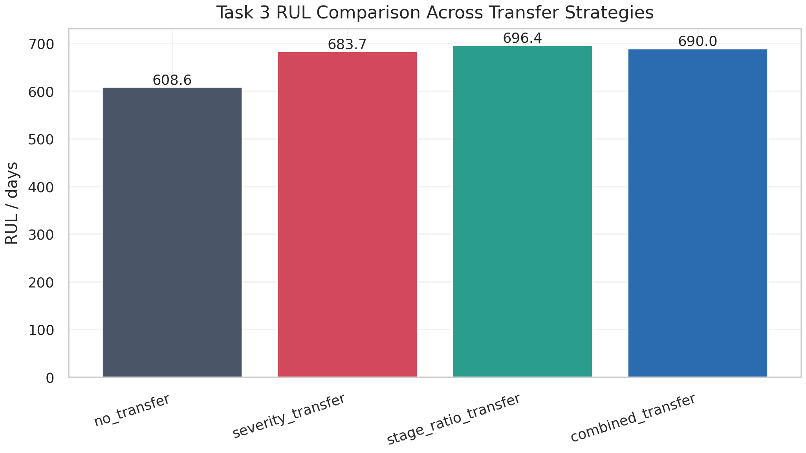
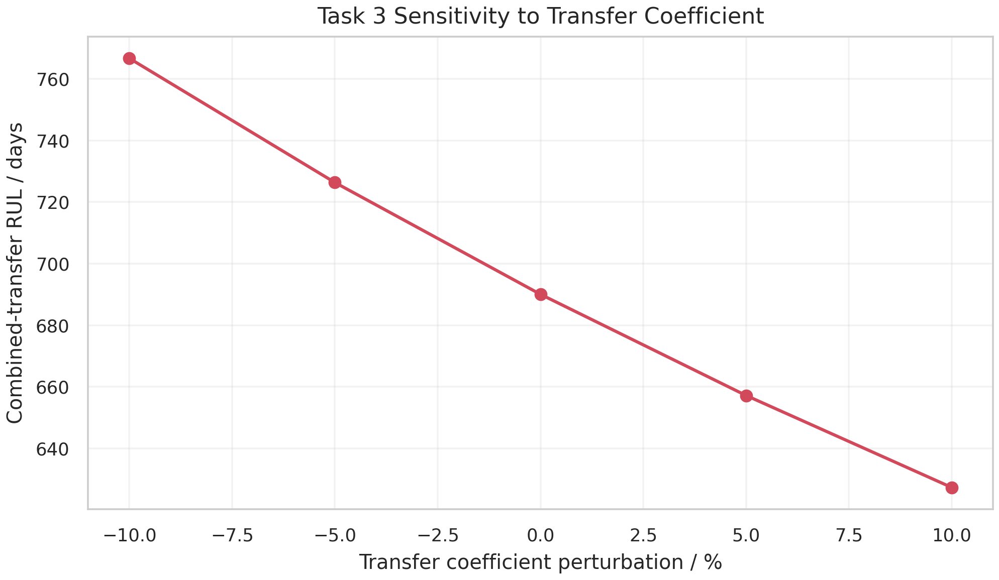

# 任务三与任务四报告：跨领域迁移学习与飞轮健康管理

## 1. 当前健康状态

附件 2 当前观测至第 `1800` 天，任务一判定当前阶段为 `Accelerated Degradation`。
任务一 A1-calibrated common HI 当前值为 `0.5697`，无迁移推荐 RUL 为 `608.6` 天。
结合增强后的综合迁移校准后，推荐 RUL 为 `690.0` 天，区间为 `[627.3, 766.7]` 天。
当前预警等级为：`Level 2 - Warning`。

## 2. 迁移学习合理性

滚动轴承和反作用轮轴承具有相同的关键退化机理：润滑状态恶化导致摩擦增强，进而表现为振动能量、电流或温度等观测量上升。
只使用附件 2 已观测 0-1800 天计算的跨域相似度为 `0.9931`，趋势相关系数为 `0.9874`。
扩展预测轨迹与轴承全寿命均值轨迹的相似度为 `0.9902`，说明两类退化过程在健康状态空间中具有较强同向性。

## 3. 迁移策略

本报告中的健康管理推荐采用物理一致性约束下的退化严重度迁移校准。具体做法是：保留队友任务一给出的 A1-calibrated common HI RUL 作为无迁移基线，再利用 XJTU-SY 轴承后期退化 HI 分布、阶段比例和高质量退化特征，对附件 2 的 RUL 进行校准。
训练式 DANN/CORAL/MMD/AutoEncoder 深度域适配实验已另行完成，并作为增强验证和保守对照写入 `reports/deep_transfer_report_cn.md` 与 `reports/task3_deep_transfer_integrated_report_cn.md`。
该策略迁移的是归一化退化状态和后期严重度，而不是直接迁移分钟级轴承寿命，因此避免了轴承加速寿命试验和飞轮在轨天级数据之间的时间尺度冲突。

## 4. RUL 对比

| 方法 | EOL day | RUL / days |
|---|---:|---:|
| no_transfer | 2408.6 | 608.6 |
| severity_transfer | 2483.7 | 683.7 |
| stage_ratio_transfer | 2496.4 | 696.4 |
| combined_transfer | 2490.0 | 690.0 |

严重度迁移因子 severity_scale = `0.8901`，迁移置信度 = `0.7132`。

## 5. 敏感性分析

对综合迁移系数进行 `-10%`、`-5%`、`0`、`+5%`、`+10%` 扰动，检查推荐 RUL 对迁移系数的敏感程度。结果写入 `results/task3_transfer_sensitivity.csv`。

## 6. 预警机制与建议

| 等级 | 判据 | 含义 |
|---|---|---|
| Level 0 - Normal | 健康期且 RUL > 730 天 | 正常运行 |
| Level 1 - Attention | 缓慢退化或 HI 升高 | 趋势关注 |
| Level 2 - Warning | 加速退化或 RUL <= 730 天 | 重点监测 |
| Level 3 - Critical | 加速退化且 HI 高或 RUL <= 365 天 | 高风险 |

当前建议：进入重点监测，缩短健康评估周期，限制连续长时间高转速工作。

## 7. 高质量迁移特征 Top 5

| 特征 | 单调性 | 趋势性 | 稳定性 | 可迁移性 | 综合评分 |
|---|---:|---:|---:|---:|---:|
| resultant_mean | 0.1975 | 0.6864 | 0.9772 | 0.7765 | 0.5870 |
| resultant_mean_abs | 0.1975 | 0.6864 | 0.9772 | 0.7765 | 0.5870 |
| resultant_rms | 0.1998 | 0.6809 | 0.9769 | 0.7720 | 0.5854 |
| vertical_mean_abs | 0.1701 | 0.6769 | 0.9744 | 0.7835 | 0.5750 |
| horizontal_band_energy_4 | 0.0548 | 0.7770 | 0.9498 | 0.8710 | 0.5729 |

## 8. 不确定性与局限性

- XJTU-SY 是地面加速寿命试验，飞轮附件 2 是在轨监测数据，两者工作环境和采样模态不同。
- 当前迁移方法强调可解释性和稳健性，尚不是端到端深度域适配模型。
- 附件 2 缺少真实失效终点，因此 RUL 是模型外推估计。
- 预警等级应作为工程辅助决策，不能替代姿控系统安全规则。

## 9. 图像

